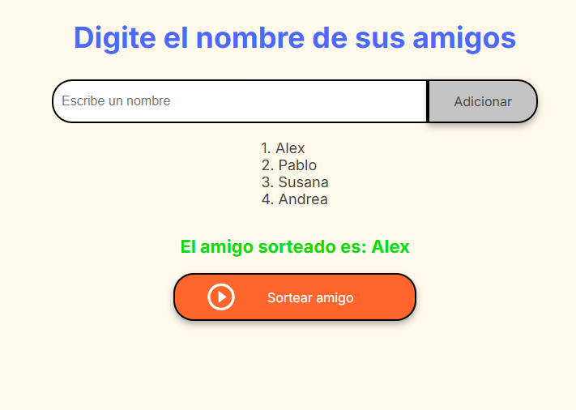

<h1> Juego del Amigo Secreto </h1>

<h2> Descripción del Proyecto </h2>

 El juego del Amigo Secreto es una aplicación web que permite al usuario agregar una lista de amigos
y realizar un sorteo aleatorio para que uno salga seleccionado. Puede ser de mucha utilidad para escoger
a una persona al azar de manera divertida y dinámica.

<h2> Como funciona el juego</h2>
<h3> Agregar amigos</h3>
<ul>
  <li>Escribe el nombre de tu amigo en el campo en blanco o de entrada.</li>
  <li>Haz clic en el botón "Adicionar" para añadirlos a la lista.</li>
  <li>El juego actualmente solo permite agregar 10 amigos como máximo</li>
</ul>

<h3> Lista de amigos</h3>
<ul>
  <li>Cada amigo añadido aparece en la pantalla en una lista enumerada.</li>
  <li>El tener la lista te permitirá ver los nombres que ya se han añadido.</li>
</ul>

<h3> Desarrollo</h3>

Esta aplicación esta 100% funcional, sin embargo sigue en proceso de mejora
 para añadir más caracteristicas. Como pueden ser:

<ul>
  <li>Agregar un boton para reiniciar el juego.</li>
  <li>Cambio y mejora de la parte visual.</li>
  <li>Entre otras mejoras que se pueden aplicar.</li>
</ul>

<h2>¡Prueba el Juego!</h2>

Ve al archivo principal y abre el juego en tu navegador para disfrutar de un sorteo al azar.

<h2>Imagenes del juego</h2>
<h3>Versión 1 del juego</h3>

 Pantalla inicial en el navegador 

 Pantalla demostrando el aspecto de el listado y el resultado del sorteo. 

